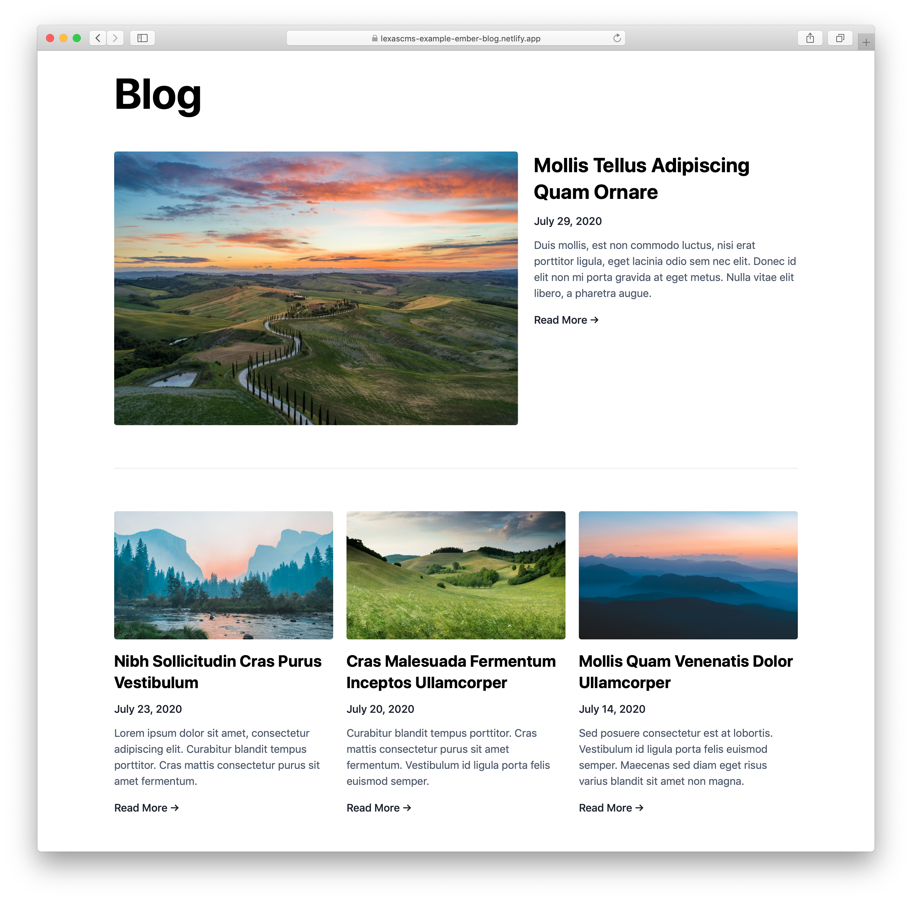

# Ember.js Blog Example

This repo contains an example of a blog which has been built using [Ember.js](https://emberjs.com/), with the content being pulled from [LexasCMS](https://www.lexascms.com/).

  

## Live Demo

[Click here](https://lexascms-example-ember-blog.netlify.app/) to view a live demo of this repo.

## Deploy to Netlify

Before deploying this repo, you'll need to have created a space using the **Blog Starter Template** in your LexasCMS account.

After creating your new space, copy your space ID and then click the button below to deploy the project to [Netlify](https://www.netlify.com/).

If you don't yet have an account, you can [click here](https://app.lexascms.com/signup) to start a free trial.

## Ember Twiddle

If you'd prefer to have a play around with this example without deploying your own version, we have also created an Ember Twiddle which you can find by clicking the link below.

[Open Ember Twiddle](https://ember-twiddle.com/ec667248ae703707db4e2157709eae4c)
